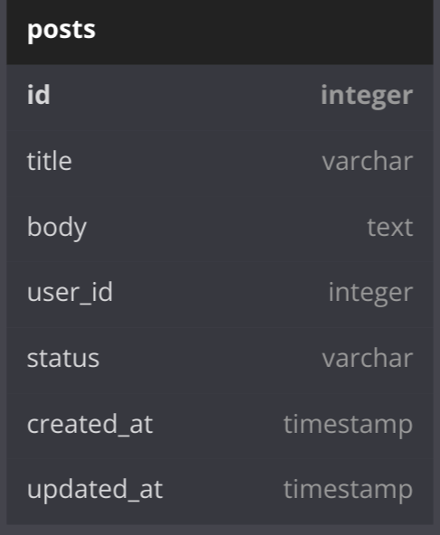
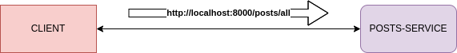

<h1 align="center"> Geek Theories </h1>

 <a href="#about">Sobre</a> |
 <a href="#entities">Entidades</a> |
 <a href="#microservices">Microserviços</a> |

<h2 id="about">💡&nbsp; Sobre o projeto </h2>

Blog sobre Teorias Geek em que os usuários podem se registrar, criar, publicar e comentar postagens.

---

<h2 id="entities">👥&nbsp; Entidades </h2>

  

---

<h2 id="microservices">📍&nbsp; Microserviços </h2>

 

---

<h2 id="author">👨‍💻&nbsp;Desenvolvedor</h2>

👤 [Riquelme Damião Silva](https://github.com/the-riquelme)
